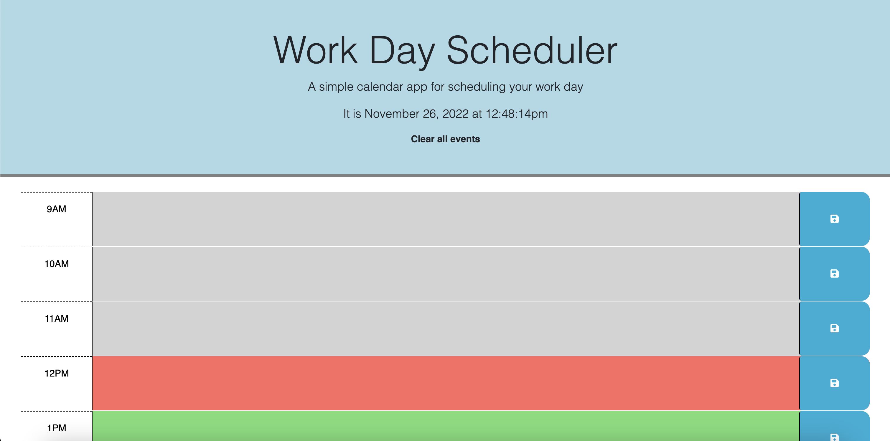

# Work Day Scheduler

## Description
This application was built to help users organize their day. It allows users to type events or descriptions into the text boxes beside each given time and then save them individually for each hour. The visuals on the page also change based off of the whether each given time has already past, is the present time, or is a time coming later in the day. The user has the option to clear all events to avoid having the manually clear each event manually.

## Live application
The deployed webpage can be found here: https://retrotechcode.github.io/Work-day-scheduler/